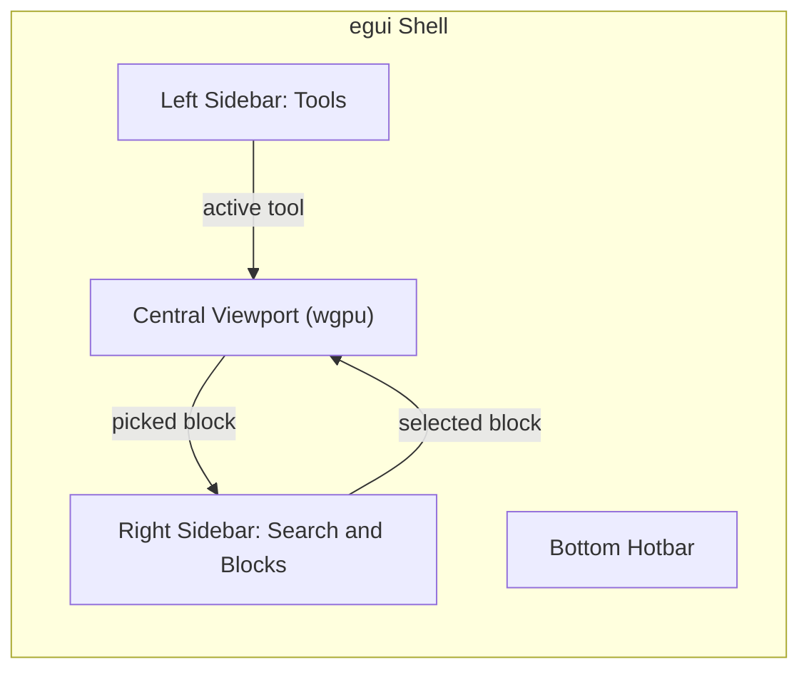
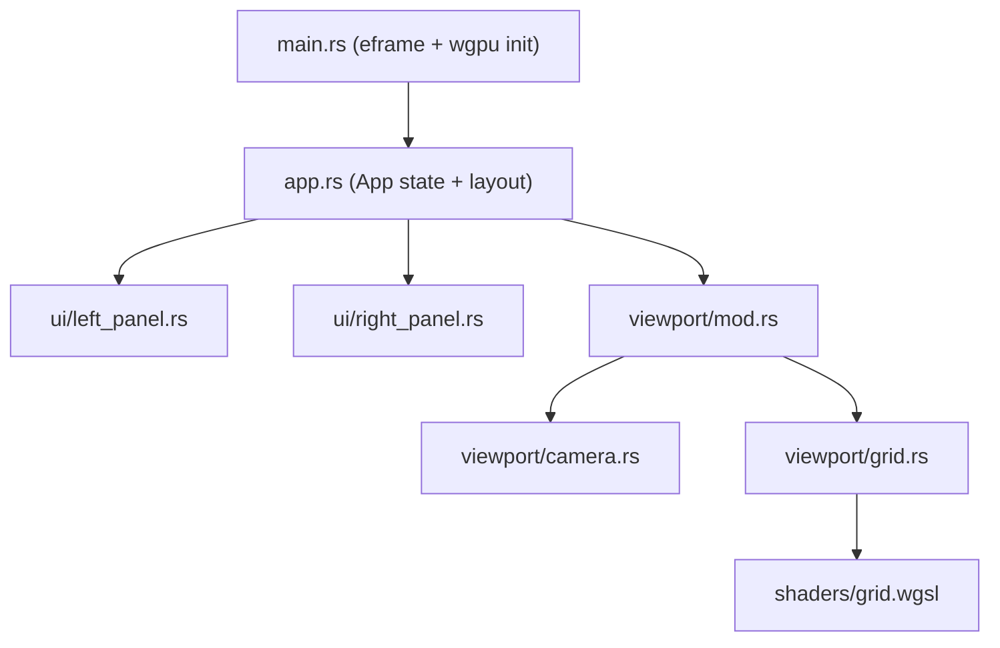

# Architecture: Minecraft NBT Structure Editor

A desktop editor for Minecraft structure `.nbt` files, written in Rust. The UI shell is
built with `egui` (via `eframe`) and the 3D viewport is rendered with `wgpu`, embedded
into the egui layout through `egui_wgpu` paint callbacks. The editing experience is
modeled after Blender: a central 3D viewport with smooth, inertia-free navigation,
tools on the left, and data browsing/search on the right.

See [project_plan.md](project_plan.md) for the phased implementation plan and the
underlying NBT / asset data models.

---

## 1. UI Layout

```
+------+--------------------------------------------------+-----------+
|      |                                                  |           |
| Left |                                                  |   Right   |
| Side |                3D Viewport                       |  Sidebar  |
| bar  |            (wgpu render target)                  |           |
|      |                                                  |  - Search |
| Tools|      - Reference grid (first milestone)          |  - Block  |
|      |      - Structure blocks                          |    picker |
|      |      - Selection highlights                      |  - Props  |
|      |                                                  |           |
+------+--------------------------------------------------+-----------+
|                        Bottom Hotbar                                |
+---------------------------------------------------------------------+
```



### Left Sidebar: Tools
Vertical strip of tool buttons (single active tool at a time):
select, place, delete, fill/cuboid, line, cylinder, rotate, translate.
The active tool determines how mouse interaction in the viewport is interpreted.

### Right Sidebar: Block Search & Selection
- **Search field** filtering the known block palette by name.
- **Block picker list** showing matching blocks; clicking one makes it the active
  block for placement tools.
- **Properties panel** (later phase) showing blockstate properties and block entity
  NBT for the current selection.

### Central Viewport
An `egui` widget whose pixels are produced by a `wgpu` render pass injected through
`egui_wgpu::Callback`. The first milestone is a Blender-style reference grid:

- Ground grid on the XZ plane (Minecraft's horizontal plane), with major/minor lines.
- Colored world axes: X = red, Y = green, Z = blue.
- Depth buffer enabled so future block meshes compose correctly with the grid.

### Viewport Navigation (Blender-style, smooth)
- **Scroll wheel**: zooms toward the point currently under the cursor. The cursor ray
  is unprojected into the world and the camera moves along it, so the point under the
  mouse stays fixed while zooming.
- **W / A / S / D**: pans the camera focus point in the camera's horizontal plane.
  Movement is applied per-frame scaled by delta-time and camera distance, giving
  smooth, resolution-independent motion.
- **Mouse drag**: turntable orbit around the focus point. Horizontal drag rotates
  the yaw, vertical drag tilts the pitch (clamped short of the poles to avoid
  flipping).

---

## 2. Folder Structure

```
Cargo.toml
Architecture.md          # this document
project_plan.md          # phased implementation plan and data models
src/
  main.rs                # eframe entry point, wgpu backend selection
  app.rs                 # top-level App: panel layout, shared editor state
  ui/
    mod.rs
    left_panel.rs        # tool sidebar (tool enum + buttons)
    right_panel.rs       # block search field + block picker list
  viewport/
    mod.rs               # viewport widget: input handling, paint callback dispatch
    camera.rs            # camera state, view/projection math, zoom + pan logic
    grid.rs              # wgpu pipeline + vertex generation for grid and axes
    shaders/
      grid.wgsl          # line vertex/fragment shader (per-vertex color)
```

Planned modules for later phases (per [project_plan.md](project_plan.md)):

```
src/
  nbt/                   # fastnbt-based .nbt parsing and export (Phase 1)
  assets/                # blockstate/model JSON resolution, texture atlas (Phase 1)
  world/                 # sparse 3D voxel grid, palette, edit operations (Phase 1)
  render/                # block mesh builder, CPU face culling, block pipeline (Phase 2)
  tools/                 # tool implementations: raycasting, placement, shapes (Phase 3)
```

---

## 3. Module Responsibilities & Data Flow



- **`main.rs`** configures `eframe::NativeOptions` to use the `wgpu` renderer and
  starts the app.
- **`app.rs`** owns all editor state (active tool, block search text, selected block,
  camera) and lays out the panels each frame. Panels receive `&mut` slices of that
  state; there is no global state.
- **`viewport/mod.rs`** allocates the central panel rect, feeds input (scroll,
  cursor position, WASD key state, delta-time) to the camera, then submits an
  `egui_wgpu::Callback` carrying the view-projection matrix.
- **`viewport/camera.rs`** is pure math: focus point + yaw/pitch + distance,
  producing view and projection matrices, plus `zoom_toward(cursor_ray, amount)` and
  `pan(direction, dt)`.
- **`viewport/grid.rs`** holds the wgpu resources (pipeline, vertex buffer, uniform
  buffer) created once via the `egui_wgpu` renderer callback resources map, and
  records the draw call each frame.

### Rendering integration
`egui_wgpu` runs callback `prepare()` (buffer uploads) and `paint()` (draw commands
inside egui's render pass). The grid pipeline therefore renders directly into the
egui pass, clipped to the viewport rect, sharing egui's depth-stencil configuration.

---

## 4. Milestones

1. **Grid viewport (this skeleton)**: panels + camera + reference grid with
   zoom-to-cursor and WASD panning.
2. **NBT loading**: parse `.nbt` into a sparse voxel grid, render blocks as flat-color
   cubes with CPU face culling.
3. **Assets**: resolve blockstate/model JSONs, build texture atlas, textured meshes.
4. **Editing tools**: raycast picking, placement/deletion, shape tools, undo/redo,
   NBT export.
