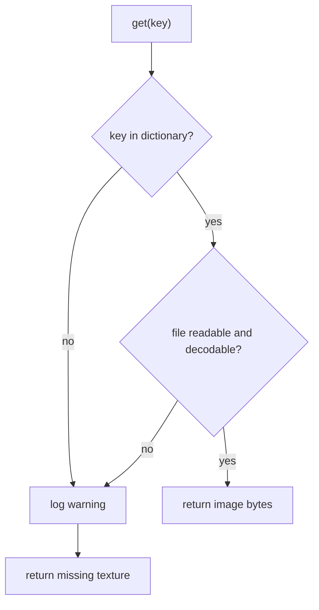

# Implementation Plan: Minecraft Create Mod NBT Editor

## Goal Description
Build a GUI application that enables reading, rendering, editing, and exporting Minecraft structure NBT files. The editor is written in Rust using `egui` for the UI shell and `wgpu` for 3D hardware-accelerated rendering.

---

## 1. System Architecture

The following diagram illustrates the flow of data from inputs (NBT files and Minecraft assets) to memory representation, rendering pipeline, and GUI controls.

```mermaid
graph TD
    subgraph Input Files
        NBT[".nbt Structure File"]
        Jar["Minecraft Client .jar / Asset Pack"]
    end

    subgraph Data Loading & Parsing
        NBT_P["NBT Parser (fastnbt)"]
        Asset_P["Asset Resolver (JSON models & blockstates)"]
        Atlas_G["Texture Atlas Generator"]
    end

    subgraph Application Core State
        V_Grid["3D Voxel Grid (Spatial Map)"]
        E_State["Editor State (Tool, Palette, Selection)"]
    end

    subgraph Rendering Pipeline (wgpu)
        CPU_Cull["Rust-side CPU Face Culling"]
        GPU_Buf["GPU Vertex / Instance Buffers"]
        Render_P["Render Pass (Opaque & Grid)"]
        RT_Tex["Render Target Texture"]
    end


    NBT --> NBT_P
    Jar --> Asset_P
    Asset_P --> Atlas_G
    NBT_P --> V_Grid
    
    V_Grid --> CPU_Cull
    CPU_Cull --> GPU_Buf
    GPU_Buf --> Render_P
    Atlas_G --> Render_P
    
    Render_P --> RT_Tex
 
    E_State --> V_Grid
    V_Grid --> NBT
```

```mermaid
graph TD

    subgraph GUI (egui)
        Shell["egui UI Shell"]
        L_Sidebar["Left Sidebar: Tools"]
        R_Sidebar["Right Sidebar: Search & Properties"]
        B_Bar["Bottom Hotbar"]
        V_Port["Viewport Widget"]
    end

    Shell --> V_Port

```

---

## 2. Background: Underlying Data Models

To render and edit the structure, the editor bridges three distinct data layers:

```
+-----------------------------------------------------------------------------------+
| 1. NBT Structure Representation                                                   |
|    - Palette: List of Blockstate names + Properties (e.g. minecraft:lever[face=wall]) |
|    - Blocks: List of coordinates [x,y,z] + palette index + block entity data      |
+-----------------------------------------------------------------------------------+
                                         │
                                         ▼ (Resolved by)
+-----------------------------------------------------------------------------------+
| 2. Minecraft Asset Models                                                         |
|    - Blockstates JSON: Maps palette properties to a specific model JSON file      |
|    - Models JSON: Hierarchical cuboid elements (coords 0-16) and texture variables |
+-----------------------------------------------------------------------------------+
                                         │
                                         ▼ (Compiled into)
+-----------------------------------------------------------------------------------+
| 3. Render Mesh & Textures                                                         |
|    - Voxel Grid: 3D array of indices or references to the loaded block definitions|
|    - Texture Atlas: Stitched 2D sheet containing all resolved face textures       |
+-----------------------------------------------------------------------------------+
```

### 2.1. NBT Structure
A structure schematic is stored as an NBT compound:
*   **Size**: `[width, height, length]` defining the coordinate boundaries.
*   **Palette**: A list of compound tags defining blockstates (e.g., name, properties).
*   **Blocks**: A flat list of blocks, each having a relative position `pos` `[x, y, z]` and an index pointing to the palette.

### 2.2. Blockstates and Model JSONs
*   **Blockstate Mapping**: For each block in the palette, the editor resolves its properties against the blockstate JSON (e.g., checking orientation/state) to determine the target 3D model.
*   **Model Composition**: Models define custom geometries via cuboids (`from`, `to`). If a model inherits from a `parent`, properties and textures are merged down the chain.
*   **Atlas Stitched Coordinates**: To avoid bind-group switching overhead, all texture paths from the models are resolved, loaded, and compiled into a single texture atlas with mapped UV boundaries.

---

## 3. Texture Storage

Block textures are extracted from a Minecraft client `.jar` to an on-disk cache, indexed by a
JSON manifest, and read back on demand. Only the `.jar` is supported as an input source for now.

### 3.1. Extraction

The `.jar` is a zip archive. Entries are filtered on the path layout used by the client
(see [`02_render_nbt_file.ipynb`](02_render_nbt_file.ipynb), section 6):

```
assets/{namespace}/textures/block/{file}.{png|bmp|jpg}
```

Each matching entry is written to `./texture_cache/` under its original file name. Entries with
any other extension are skipped. Extraction is a one-off import step, not part of startup.

### 3.2. Cache Layout

```
texture_cache/
  textures.json        # manifest: key -> texture record
  stone.png
  glass.png
  ...
assets/
  image-missing.png    # static fallback, shipped with the app
```

The dictionary key is the file stem (file name without extension, e.g. `glass`). Every key maps
to exactly one file in `./texture_cache/`. `texture_cache/` is gitignored.

### 3.3. Modules (`./src/textures/`)

| File | Responsibility |
| --- | --- |
| `mod.rs` | Module declarations and re-exports. |
| `texture.rs` | `Texture` record and `ImageFormat` enum. |
| `library.rs` | `TextureLibrary`: the dictionary, manifest load/save, and queries. |
| `jar.rs` | Jar scanning and extraction into `./texture_cache/`. |

A `Texture` is a reference to a cached file plus its metadata. It holds no pixel data:

```rust
pub enum ImageFormat { Png, Bmp, Jpg }

pub struct Texture {
    /// File name within `./texture_cache/`, including extension.
    file_name: String,
    format: ImageFormat,
    /// True if any pixel has an alpha value below 255.
    has_alpha: bool,
}
```

`has_alpha` is computed once at extraction time by decoding the image and scanning the alpha
channel. Formats that carry no alpha channel (`bmp`, `jpg`) are recorded as `false` without a
scan. The flag lets the renderer sort textures into opaque and alpha-discard draw batches
without re-decoding.

### 3.4. Manifest (`textures.json`)

`TextureLibrary` serialises the whole dictionary to `./texture_cache/textures.json` via
`serde_json` after an extraction run:

```json
{
  "stone": { "file_name": "stone.png",  "format": "png", "has_alpha": false },
  "glass": { "file_name": "glass.png",  "format": "png", "has_alpha": true }
}
```

### 3.5. Startup

1. The fallback image at the path given by `Config::missing_texture_path()`
   (`./assets/image-missing.png`) is decoded and held for the lifetime of the process. If it
   cannot be loaded, an error is logged; the application continues.
2. If `textures.json` exists it is deserialised into the in-memory dictionary. If it is absent
   or fails to parse, the dictionary starts empty and a jar import is required before textures
   resolve.

### 3.6. Query

`TextureLibrary::get(key)` returns decoded image bytes:



Both failure paths — key absent from the dictionary, and file absent or unreadable on disk —
log a warning and return the fallback image, so a caller always receives usable bytes. Decoded
images are memoised in the library so repeated queries do not re-read from disk.

### 3.7. Configuration

`Config` gains the texture paths:

*   `texture_cache_dir()` - `./texture_cache`
*   `textures_manifest_path()` - `./texture_cache/textures.json`
*   `missing_texture_path()` - `./assets/image-missing.png`

### 3.8. Dependencies

`zip` (archive reading), `image` (decoding png/bmp/jpg and alpha inspection), `serde` +
`serde_json` (manifest), `log` (warnings and errors).

---

## 4. High-Level Implementation Plan

The implementation is broken down into four key phases, moving from initial validation to final integration:

### Phase 1: Core Data Engine (Rust)
Set up the backend storage, asset loader, and file parser in Rust.
*   **NBT Serialization**: Parse and export `.nbt` structures via `fastnbt`.
*   **Asset Processing**: Load client assets, resolve model JSON hierarchies, and construct the texture atlas.
*   **Spatial Representation**: Construct an in-memory 3D sparse grid that allows fast lookups for culling and editing.

### Phase 2: Rust wgpu Rendering Port
Port the rendering architecture to Rust.
*   **GPU Pipeline**: Create vertex buffers, texture binding groups, uniform buffers, and render pipelines.
*   **Voxel Mesh Builder**: Translate the CPU culling logic to Rust. Construct meshes dynamically from the spatial grid.
*   **Interactivity Pass**: Handle mouse-to-world raycasting to highlight block faces and grid lines.

### Phase 3: GUI Shell & Editor Operations (egui)
Build the user interface and implement editing tools.
*   **egui Integration**: Render the wgpu canvas to an off-screen texture and embed it in egui.
*   **Layout Panels**: Create the tool sidebars, search palette, block details window, and bottom hotbar.
*   **Editor Commands**: Implement translation, rotation, deletion, selection, and procedural shape placement (lines, cuboids, cylinders).
